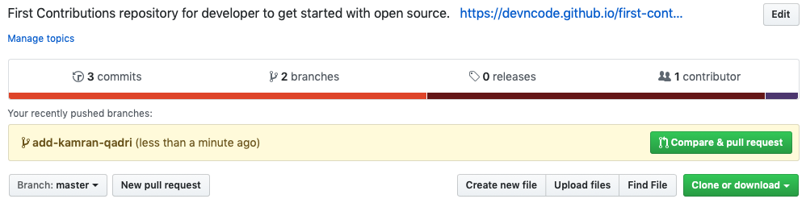
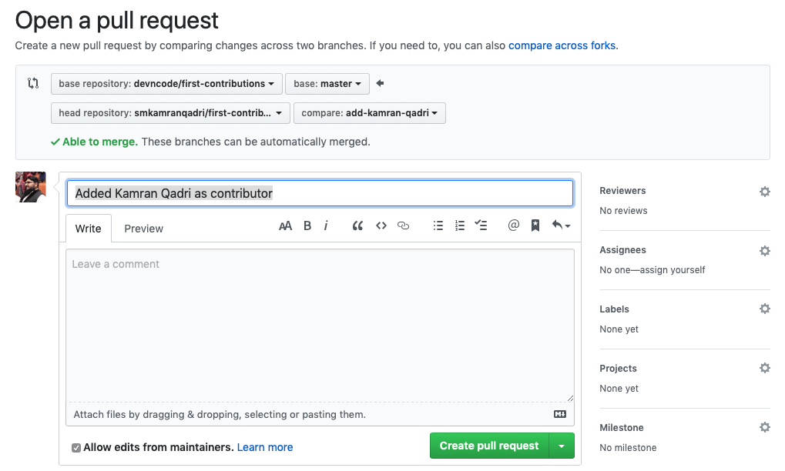

[](https://github.com/ellerbrock/open-source-badges/)
[](https://opensource.org/licenses/MIT)
[](https://github.com/devncode/first-contributions/pulls)

# First Contribution

- Thinking about doing open source contribution?
- Don't know where to start or how to do?
- Looking for a simple repository to help you to get started?

Then look no further, we have created this repository to help you to get started.

## Just for the instruction!


If you don't have git installed in your machine, [install it](https://help.github.com/articles/set-up-git/).

## Fork this repository

Fork this repository by clicking on the fork button on the top of this page.
This will create a copy of this repository in your account.

## Clone the repository


Now clone the forked repository to your machine. Go to your GitHub account, open the forked repository, click on the clone button and then click the _copy to clipboard_ icon.

Open a terminal and run the following git command:

```
git clone "url you just copied"
```


For example:

```
git clone https://github.com/this-is-you/first-contributions.git
```

where `this-is-you` is your GitHub username. Here you're copying the contents of the first-contributions repository in GitHub to your computer.

## Create a branch

Change to the repository directory on your computer (if you are not already there):

```
cd first-contributions
```

Now create a branch using the `git checkout` command:

```
git checkout -b <add-your-new-branch-name>
```

For example:

```
git checkout -b add-muhammad
```

(The name of the branch does not need to have the word _add_ in it, but it's a reasonable thing to include because the purpose of this branch is to add your name to a list.)

## Make necessary changes and commit those changes

Now open `contributions.yml` file from `_data` directory in a text editor, add your name with emoji of your country flag, github_account and profile picture url (avatar) to it. Don't add it at the beginning or end of the file. Put it anywhere in between. Now, save the file.


If you go to the project directory and execute the command `git status`, you'll see there are changes.

Add those changes to the branch you just created using the `git add` command:

```
git add _data/contributions.yml
```

Now commit those changes using the `git commit` command:

```
git commit -m "Add <your-name> to Contributors list"
```

replace `<your-name>` with your name.

## Push changes to GitHub

Push your changes using the command `git push`:

```
git push origin <add-your-branch-name>
```

replace `<add-your-branch-name>` with the name of the branch you created earlier.

## Submit your changes for review

Now if you go to your repository on GitHub, you'll see a `Compare & pull request` button. Click on that button.



Now submit the pull request.



Soon, I'll be merging all your pull requests into the master branch of this project. You will get a notification email once the changes have been merged.

## Contributors

Thank you to all the contributors who help in making this project better :raised_hands:

<a href="https://github.com/smkamranqadri"></a><a href="https://github.com/Mohammad-Quanit"></a><a href="https://github.com/Shahid0343"></a><a href="https://github.com/rehan-sattar"></a><a href="https://github.com/hasanabid992"></a><a href="https://github.com/aliasgharkarani"></a><a href="https://github.com/GhulamMustufa"></a><a href="https://github.com/iqbaltrainer"></a><a href="https://github.com/NomanGul"></a><a href="https://github.com/128bhakti"></a><a href="https://github.com/agungjsp"></a><a href="https://github.com/AleeSeydoux"></a><a href="https://github.com/AliTechGeek52"></a><a href="https://github.com/Camiila23"></a><a href="https://github.com/donycisneros"></a><a href="https://github.com/Huzaifaahmed20"></a><a href="https://github.com/Johan-Ng"></a><a href="https://github.com/kimberleejohnson"></a><a href="https://github.com/RandomChikbum"></a><a href="https://github.com/LalitKushwah"></a><a href="https://github.com/paidegua"></a><a href="https://github.com/Valeyard1"></a><a href="https://github.com/mateohoxha"></a><a href="https://github.com/mathcale"></a><a href="https://github.com/mehakg867"></a><a href="https://github.com/muhammadahad96"></a><a href="https://github.com/PaulaAsto"></a><a href="https://github.com/pataar"></a><a href="https://github.com/Rangkynsai"></a><a href="https://github.com/JustTalDevelops"></a>
